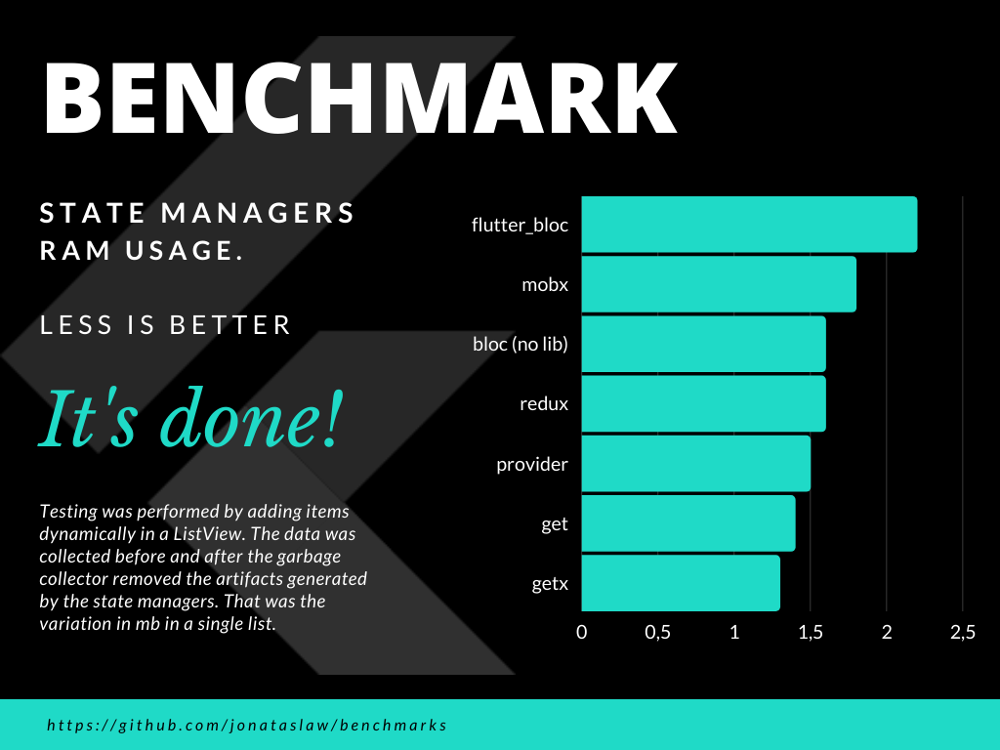

# benchmarks
A repository to benchmark Flutter libs.
Creators of the tested libs can suggest improvements, as long as they follow the same design structure.

# 1- State Managers

The idle application consumes 4.0mb of ram.
Items were added dynamically to a ListView, and after the test was completed, a screenshot was taken. The garbage collector was triggered manually, and another screenshot was taken.
The added RAM added to the idle application was measured.

## No GC 

Mobx = 4.58 

Bloc = 4.56 

Redux = 4.56

Bloc-Lib = 4.55 

Provider = 4.55 

GetX = 4.53 

Get = 4.53

## GC 

Bloc-lib = 4.22 

Mobx = 4.18

Bloc = 4.16 

Redux = 4.16 

Provider = 4.15 

Get = 4.14

GetX = 4.13 

- NOTE: The proportion of the metrics are correct, but the difference is after the comma, so don't read as 1.5mb, but 150kb, don't read as 2mb, but 200k.

A more robust benchmark is being made and the typo in Banners will be replaced.

